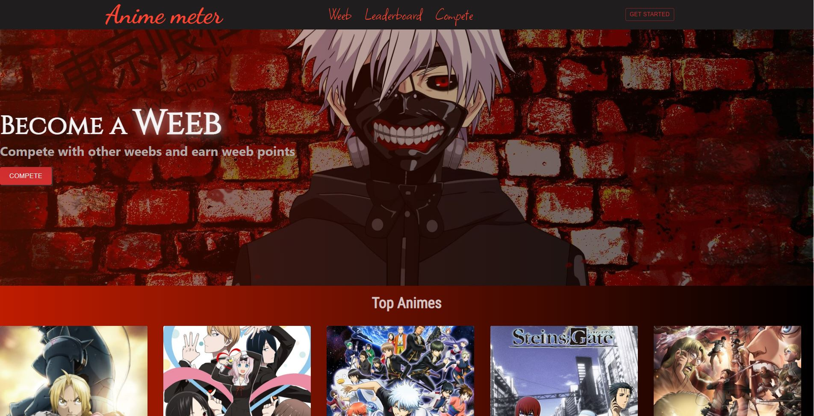

# Anime meter

A Game from anime fans to compete wit heach other and make a score. The game will keeep track of your record and update leaderboard. So now you have your Score to show off to your weeb friends and brag about being a better weeb.

## Badges

[](https://github.com/tterb/atomic-design-ui/blob/master/LICENSEs)

# About the project

## Built with

    React Js

## Installation

Install animemeter with npm

```bash
  cd animemeter

  npm install

  npm start
```

## Tech Stack

**Client:** React

**Server:** Node, Express
